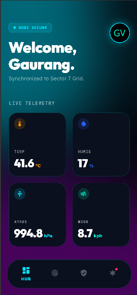
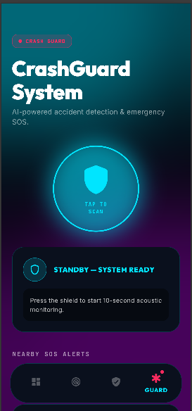
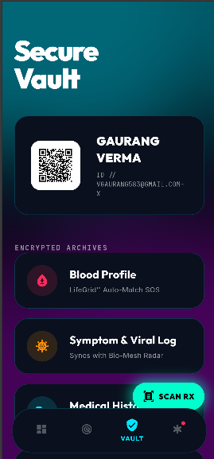
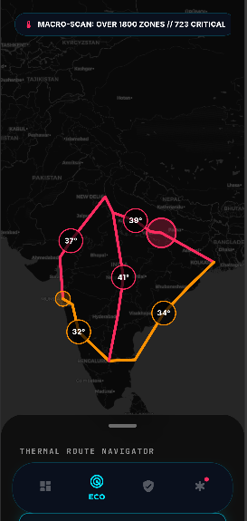
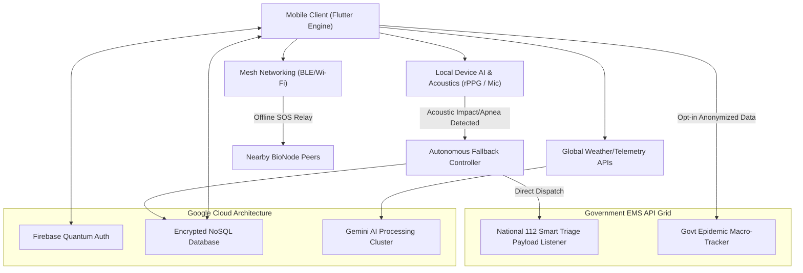

<div align="center">
  
  
  
  
  <br />
  <h1>🧬 BioNode AI</h1>
  <p><b>Next-Generation Intelligence & Survival OS</b></p>
  <p><i>A comprehensive, government-grade digital health ecosystem built to unify personal safety paradigms with global bio-surveillance scaling.</i></p>
</div>

---

## 📖 Executive Vision
**BioNode AI** shatters the constraints of traditional healthcare and safety mobile applications. Engineered at the bleeding edge of Artificial Intelligence and mobile hardware utilization, BioNode acts as an autonomous operating system for human survival. By merging localized sensor arrays (acoustic, visual, and telemetry) with the Google Gemini LLM infrastructure, the platform transforms a consumer device into a proactive guardian capable of anticipating threats, diagnosing physiological anomalies, and establishing ad-hoc disaster networks.

Built with **Zero-Latency Orchestration** and **Absolute Quantum-Grade Privacy**, BioNode is scaled to function both as an intimate personal tool and a macro-level intelligence grid for national emergency services.

---

## 📱 Interface Paradigms
<p align="center">
  
  &nbsp;
  
  &nbsp;
  
  &nbsp;
  
</p>
<p align="center"><i>Utilizing 40px Sigma Blur Glassmorphism & Custom Dart Vector Render Pipelines.</i></p>

---

## 🚀 The 14 Pillars (Core Capabilities)

### 🌍 A. Macro Intelligence & Environment
1. **Environmental AI Radar:** Fetches hyper-local meteorological data (Pressure, Humidity, Temp) and streams it to Gemini Pro to generate live, context-aware survival strategies and warnings.
2. **Crowd-Sourced Bio-Surveillance Heatmap:** Aggregates anonymized civic health data to construct a dynamic, real-time epidemic and toxic zone tracker for public health macro-analysis.
3. **Quantum Circadian Predictor:** Correlates sharp drops in barometric pressure with historical biometric data to strictly forecast precise "Energy Crashes" in the user’s schedule.

### 🛡️ B. Defensive Automation & Rescue
4. **CrashGuard Acoustic Engine:** Zero-touch localized acoustic analytics continuously detects high-variance decibel impacts (accidents) and automatically initiates secure panic protocols.
5. **AI Smart Triage EMS Grid:** Upon severe incident detection, the OS dynamically packages the local audio, coordinates, and health SSR into an automated POST payload directly transmitted to 112 / Regional Medical Grids.
6. **Ad-Hoc Swarm Mesh Network:** Bypasses telecom failures during disasters by establishing a localized peer-to-peer Bluetooth/Wi-Fi Direct mesh, creating off-grid cellular survival links.
7. **Sentinel Predictive Threat:** Ambient contextual monitoring mode designed for isolated individuals. Detects route deviation and sensor anomalies to predict predatory scenarios.

### ⚕️ C. Clinical-Grade Medical Vault
8. **Decentralized Health SSR:** End-to-end encrypted persistent storage mechanism for severe medical conditions, allergies, and organ-donor statuses.
9. **AI Vitals Scanner (rPPG):** Employs Remote Photoplethysmography via the smartphone's front-facing optics to invisibly read sub-dermal capillary color variance, mapping resting Heart Rate and SpO2 without wearables.
10. **AR Chemical Decoder (Nutri-Scan):** Real-time spatial tracking Lens that scans ingredient labels. Powered by Gemini Vision, it instantly triangulates unknown toxic chemicals against the user's allergy vault, overlaying AR warnings.
11. **QR Point-of-Care Handshake:** Dynamically generates time-sensitive, rotating cryptographic QR manifests for instant EMS scanning in triage.

### 🧠 D. Cognitive & Legacy Security
12. **Mind & Memory Blackbox:** A cyber-therapy encrypted acoustic diary. Gemini evaluates sentiment degradation dynamically over multiple sessions. If systemic anxiety or suicidal ideation triggers are reached, autonomous Rescue Protocols (family pings, audio therapy) execute immediately.
13. **Sleep-Apnea Acoustic Guardian:** Analyzes nighttime respiration cycles entirely offline. If breathing cessation or fatal apnea is detected, forces high-frequency audio strobes to aggressively jolt the neurological system awake, preventing cardiac arrest.
14. **Digital Legacy Handshake (Dead-Man's Switch):** An ultimate zero-knowledge vault holding crypto seed phrases, wills, and final thoughts. This partition mathematically unlocks and routes to exact nominees ONLY following verified hospital Triage fatality confirmations.

---

## 🏗️ System Architecture & Workflow



---

## 💻 Tech Stack Matrix

| Architectural Layer | Implementation Technology | Primary Objective |
| :--- | :--- | :--- |
| **Rendering Engine** | Flutter (Dart) 3.x | Sub-millisecond physics, Glassmorphic GPU shaders |
| **State Cloud** | Firebase Suite | Real-time scalable NoSQL (Firestore), Token Auth |
| **Cognitive Framework** | Google Gemini SDK | Massive linguistic/vision computing via REST |
| **Telemetry SDK** | OpenWeather API | Synchronous macro-environmental data points |
| **Optical / Hardware** | CoreML / Custom APIs | rPPG Computer Vision, Mesh Routing |

---

## 🛠️ Deployment Matrix & Onboarding

### Strict Prerequisites
To interface with the core logic, verify absolute compliance with:
- **Flutter SDK** (Channel Stable)
- **Dart SDK**
- **Firebase Google-Services.json & GoogleService-Info.plist** 

### 1. Repository Instantiation
Pull the primary master branch:
```bash
git clone https://github.com/developer-gaurang/BioNode-AI_Upgraded-version.git
cd BioNode-AI_Upgraded-version
```

### 2. Environmental Keys (Security Standard)
As per modern GitOps standards, API keys are securely decoupled. Instantiate a `.env` in the repository root.
```env
# CRITICAL: DO NOT COMMIT THIS FILE (Secured by .gitignore)
GEMINI_API_KEY="INSERT_YOUR_GEMINI_KEY"
FIREBASE_API_KEY="INSERT_YOUR_FIREBASE_KEY"
```

### 3. Dependency Injection & Compilation
Execute resolving and compilation sequentially:
```bash
flutter pub get
flutter run -d chrome
```

---

## 🛡️ Sovereign Security Philosophy
BioNode is designed under a Zero-Trust Doctrine. PII (Personally Identifiable Information) generated by AR Decoders, Vitals Scanners, and Cognitive Blackboxes are executed **locally whenever possible** or securely piped via HTTPS and discarded instantly post-processing. Heatmap telemetry is explicitly geo-abstracted to preserve absolute citizen sovereignty.

---

<div align="center">
  <b>Built for humanity. Scaled for the inevitable.</b><br>
  <i>BioNode AI © 2026</i>
</div>
